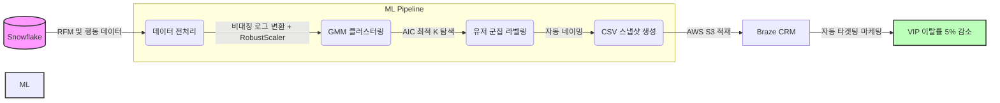

# 👥 01-1. User Clustering — GMM 기반 유저 세그먼트 및 CRM 자동화

---

## 🤔 왜 이걸 시작했나

연도별로 매출 상위 유저들의 N%가 꾸준히 이탈하고 있었습니다. 모든 유저가 소중하지만,
꾸준한 매출을 만들어주는 유저의 이탈은 성장 자체에 직결되는 문제였습니다. 동시에
이들의 세탁물 관련 VoC도 함께 증가하고 있어, 두 문제를 같이 풀어야 했습니다.

단순히 "매출 상위 N명을 지정해서 케어하자"는 식으로도 접근할 수 있었지만, 그건 근본적인
해결책이 아니라고 판단했습니다. 당시 회사는 전사적인 고객 세그먼트 체계 없이, 다년간
쌓인 마케팅/프로덕트 담당자들의 직관에 의존해 액션을 취하고 있었습니다. 예를 들어
"비가 오면 생활빨래(양말, 속옷 등) 쿠폰을 보내고, 날이 추워지는 평일엔 패딩류 쿠폰을
보낸다"는 식의 경험 기반 액션이 대부분이었습니다.

이 다년간의 직관은 분명 가치가 있지만, 이를 데이터로 정리해서 효율을 끌어올리는 게
제 역할이라고 생각했습니다. "쿠폰에 유독 잘 반응하는 유저", "세탁 주기는 일정한데 최근
앱 접속만 있고 세탁 신청은 안 하는 유저"처럼, 실제 행동 데이터 기반으로 정교한 세그먼트를
나누고 싶었습니다. 이게 유저 클러스터링을 시작한 이유입니다.

---

## 💡 비즈니스 배경 및 성과

### 1. 해결하고자 한 문제
- **핵심 고객 이탈 방어**: 고매출 상위 유저의 이탈과 관련 VoC 증가를 선제적으로 방어할 데이터 기반 관리가 필요했습니다.
- **마케팅 시스템화**: 기존의 직관적인 단발성 마케팅을 넘어, 행동 데이터 기반의 구체적인 타겟팅 세그먼트를 구축하고자 했습니다.

### 2. GMM 모델을 채택한 이유

**RobustScaler를 쓴 이유**: 아웃라이어가 유독 많은 데이터였습니다. 매출 상위 유저는
필연적으로 일반 유저 대비 극단값을 갖기 때문에, 평균/표준편차 기반 스케일링은 이 특성을
왜곡시킬 위험이 있었습니다.

**K-Means를 배제한 이유**: K-Means는 군집을 항상 원형(모든 차원의 거리가 동일한
구)으로 구분합니다. 이번 데이터는 feature가 13개에 달하는 고차원 공간이었고, 이 가정
하에서는 실제 고객 특성의 분포를 제대로 반영하지 못해 정확도가 떨어졌습니다.

**HDBSCAN을 배제한 이유**: 특정 feature들이 심하게 치우친(skewed) 분포를 갖고 있어,
실제로 클러스터링을 시도해보니 전체 유저의 약 70%가 노이즈(noise)로 분류되는 문제가
있었습니다. 이는 매출 상위 유저처럼 넓게 퍼진 값을 가진 그룹이 대거 유실된다는 뜻이라,
애초에 방어하려던 VIP 유저 자체가 분석에서 빠지는 치명적 결함이었습니다.

**GMM을 채택한 이유**: K-Means와 달리 각 군집이 자체적인 정규분포(평균 μ, 분산 σ²가
군집마다 다름)를 따른다고 가정하기 때문에, 타원형 공분산 구조로 넓게 퍼진 아웃라이어
유저 데이터까지 노이즈 없이 포용할 수 있었습니다. 다만 GMM이 제대로 작동하려면 각 군집이
정규분포를 따라야 한다는 전제가 필요했고, 이를 위해 `np.log1p` 로그 변환을 적용해
치우친 분포를 정규분포에 가깝게 맞췄습니다.

### 3. 프로젝트 성과
- **VIP 유저 이탈률 5% 감소**: 선제적 타겟팅을 통해 작년 4분기 대비 올해 1분기 이탈률을 낮추는 데 성공했습니다.
- **CRM 연동 및 타겟팅 자동화**: 군집 데이터를 사내 CRM(Braze)과 연동하여, 마케터가 별도 데이터 추출 없이 즉각적으로 타겟팅할 수 있는 환경을 구축했습니다.

---

## 🏗️ 시스템 아키텍처 (Workflow)



---

## 💻 Core Code Snippet

단순히 하드코딩된 K값을 사용하는 것을 넘어, 매월 변동하는 데이터 볼륨에 맞춰
**최적의 군집 수(K)를 동적으로 탐색하는 로직**을 구현했습니다.

```python
import numpy as np
from sklearn.mixture import GaussianMixture

# [핵심 로직] AIC 지표 기반 최적 군집 수(K) 자동 탐색
def find_best_k_by_aic_elbow(X, min_k=10, max_k=25):
    """AIC 2차 차분을 계산하여 오버피팅을 방지하는 엘보우 포인트를 찾습니다."""
    k_range = range(min_k, max_k + 1)
    aic_scores = []

    for k in k_range:
        # covariance_type='full': VVIP 등 넓게 퍼진 아웃라이어를 타원형으로 포용
        gmm = GaussianMixture(n_components=k, covariance_type='full', random_state=42)
        gmm.fit(X)
        aic_scores.append(gmm.aic(X))

    aic_diff1 = np.diff(aic_scores)
    aic_diff2 = np.diff(aic_diff1)
    elbow_index = np.argmax(aic_diff2)
    best_k = k_range[elbow_index + 1]

    return best_k
```

---

## 🛠️ Troubleshooting: 컨테이너 기반 Lambda 배포 및 실행 오류 해결

Lambda를 컨테이너 이미지(Docker)로 배포하는 과정에서 발생한 모듈 인식 및 버전 충돌 문제를
다음 3단계의 시도를 거쳐 해결했습니다.

1. **시도 A (모듈 경로 및 핸들러 수정)**: 배포 직후 `ImportModuleError`가 발생했습니다. Lambda 컨테이너가 실행 파일을 패키지 디렉토리로 오인하는 문제였고, `Dockerfile`의 실행 커맨드를 실제 파일명에 맞게 매핑하여 해결했습니다.
2. **시도 B (크로스 플랫폼 빌드 및 캐시 무효화)**: 로컬(Mac)과 AWS Lambda(Linux) 간의 아키텍처 불일치를 해결하고자 도커 빌드 시 `--platform linux/amd64`, `--provenance=false`, `--no-cache` 옵션을 강제하여 호환성을 확보했습니다.
3. **시도 C (최종 반영 파이프라인 정립)**: 이미지를 ECR에 Push했음에도 Lambda가 과거 코드를 실행하는 이슈가 있었습니다. 컨테이너 기반 Lambda는 ECR 업데이트를 자동으로 감지하지 않음을 파악하고, Lambda 콘솔에서 명시적으로 새 이미지 배포를 트리거하는 프로세스를 정립했습니다.

---

## 🛠️ Tech Stack

`AWS Lambda` `Docker` `scikit-learn (GMM)` `Snowflake` `Braze CRM` `Python`
