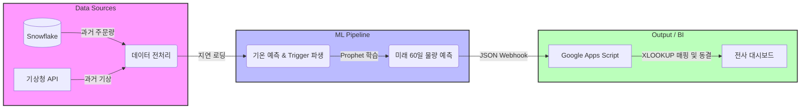

# 🧺 01-2. Laundry Forecast — Prophet 기반 세탁 물량 수요 예측 자동화

---

## 🤔 왜 이걸 시작했나

매 성수기마다 팩토리 인원 운용의 효율화가 필요했습니다. 인원 대비 물량이 적으면 인력
비용이 남용되고, 반대로 물량 대비 인원이 부족하면 내부 오피스 인원이 현장에 긴급
투입되면서 본래 업무에 차질이 생기는 상황이 반복되고 있었습니다.

세탁이라는 사업 특성상 성수기/비수기 시점이 날씨에 따라 변동된다는 건 전사적으로 이미
인지하고 있는 사실이었고, 물량·매출 담당자라면 주 단위로 날씨를 확인하는 게 기본
소양이었습니다. 기상청의 중단기 예보를 직접 확인해 인력을 배치하던 이 "직관의 영역"을,
숫자로 계산 가능한 예측 모델로 가져오고 싶었던 것이 시작이었습니다.

---

## 💡 비즈니스 배경 및 성과

### 1. 해결하고자 한 문제
- **인력 운용의 딜레마**: 성수기/비수기 전환에 따른 팩토리 인력 운용의 비효율 및 본업 차질이 반복되었습니다.
- **직관의 정량화**: 날씨에 의존하던 실무자의 감 중심 예상을, 기상청 예보 데이터 기반의 정량적인 예측 수치로 변환하고자 했습니다.

### 2. 모델 선택 근거

**날씨를 외부 변수로 넣은 이유**: 성수기/비수기 판단이 날씨에 크게 좌우된다는 건 이미
현업에서 체감하고 있던 사실이었기 때문에, 이를 정성적 판단이 아닌 정량적 회귀 변수로
모델에 직접 반영했습니다.

**Prophet을 채택한 이유**: 모든 ML 모델은 오버피팅을 경계해야 하는데, 특히 이번
데이터는 1,000 row 수준으로 양이 적어 오버피팅 위험이 더 컸습니다. 벤치마킹 결과
Prophet은 seasonality(계절성) 기반 추세를 그리는 데 우수했습니다.

- **ARIMA를 배제한 이유**: ARIMA는 정상성(Stationary) 가정에 의존해 최근 데이터에만
  강하게 반응하기 때문에, 비즈니스 성장에 따라 추세의 기울기가 바뀌거나 꺾이는
  변화점(Changepoints)에 유연하게 대응하지 못했습니다. 또한 명절·대체공휴일에 물량이
  급감/급증하는 현상을 모델에 직관적으로 반영하기 어려웠습니다.
- **LSTM을 배제한 이유**: 딥러닝 모델이 제대로 학습되려면 최소 수만~수십만 개의
  데이터가 필요합니다. 1,000개 수준의 데이터로는 모델이 수만 개의 파라미터를 학습하지
  못하고 노이즈까지 통째로 암기하는 극단적인 오버피팅이 발생할 위험이 있었습니다.

**YoY(전년 대비) 방식을 쓰지 않은 이유**: 23/24/25년의 성장세가 전혀 선형적이지
않았습니다. 23→24년은 10% 이상 성장했지만, 24→25년은 단가 인상분을 제외하면 거의
성장하지 못했습니다. 반면 25년 하반기엔 준수한 성장세를 보여, HR팀이 인력 계획을 세울
때 단기적인 상승 추세에 더 높은 가중치를 줄 기준이 필요했습니다. 단순 전년 대비 방식은
이런 비선형적 변화를 반영할 수 없었습니다.

**XGBoost·LightGBM 등 일반 ML 모델을 쓰지 않은 이유**: 단기 추세에 가중치를 둔
이유와 이어지는데, 마케팅적 요인(쿠폰, 프로모션)을 외부 변수로 넣기가 어려웠습니다.
장기간에 걸쳐 비교 가능한 대조군의 쿠폰/프로모션 데이터가 충분히 쌓여있지 않았기
때문입니다. 결과적으로 다양한 외부 변수를 반영하는 복잡한 모델보다, 전체적인 흐름과
비수기 시점의 최근 3개월 이하 단기 물량 흐름을 반영하는 게 성수기 물량 추정에 더
효과적이었습니다.

### 3. 프로젝트 성과
- **예측 오차 약 70% 감소**: 25년 상반기 기준 일 평균 오차 240건(모든 오차의 절댓값 평균)이던 것이, 25년 4분기~26년 1분기 구간에서 일 평균 76건으로 감소했습니다.
- **현장 자원 최적화**: YoY 평균 방식에서 벗어나, 최근 트렌드와 기상을 반영해 팩토리 인력을 효율적으로 배치하게 되었습니다.

> 재무적 개선 효과는 대외비로 구체적 수치 공개는 어렵습니다.

---

## 🏗️ 시스템 아키텍처 (Workflow)



---

## 💻 Core Code Snippet

1차 Prophet 모델로 향후 60일의 미래 기온을 권역별로 예측한 뒤, 전주 대비 기온 변화
수준(1도/2도/3도)에 따른 외부 회귀 Trigger 피처를 생성하는 로직입니다.

```python
import pandas as pd

def generate_weather_triggers(df_weather, predict_days=60):
    from prophet import Prophet

    future_weather_dict = {}
    for region in TARGET_STATIONS.values():
        df_temp = df_weather[df_weather['지역명'] == region][['날짜', '평균기온']].rename(
            columns={'날짜': 'ds', '평균기온': 'y'}
        ).dropna()
        m_temp = Prophet(yearly_seasonality=True, daily_seasonality=False)
        m_temp.fit(df_temp)

        future_temp = m_temp.make_future_dataframe(periods=predict_days)
        forecast_temp = m_temp.predict(future_temp)

        future_weather_dict[region] = df_temp.set_index('ds')['y'].combine_first(
            forecast_temp.set_index('ds')['yhat']
        )

    df_temp_diff = pd.DataFrame(future_weather_dict).diff(periods=7).abs()

    return pd.DataFrame({
        'temp_trigger_1deg': ((df_temp_diff >= 1.0).sum(axis=1) >= 2).astype(int),
        'temp_trigger_2deg': ((df_temp_diff >= 2.0).sum(axis=1) >= 2).astype(int),
        'temp_trigger_3deg': ((df_temp_diff >= 3.0).sum(axis=1) >= 2).astype(int)
    }).reset_index()
```

---

## 🛠️ Troubleshooting: AWS Lambda 제약 및 데이터 휘발 이슈 해결

1. **시도 A (Docker 이미지 업로드 중 Timeout 이슈)**: `prophet`, `snowflake` 등 무거운 라이브러리를 Global에서 import하다 부팅 제한시간(10초)을 초과하는 현상이 발생했습니다. `lambda_handler` 및 각 개별 함수 내부에서 호출하는 지연 로딩(Lazy Loading)으로 타임아웃을 회피했습니다.
2. **시도 B (Read-Only 경로 충돌 및 백엔드 다운그레이드)**: 최신 Prophet의 C++ 컴파일러가 Lambda의 읽기 전용 코드 경로에 파일 쓰기를 시도하다 프로세스가 강제 종료됐습니다. `/tmp` 우회 시도 후, 최종적으로 **Python 3.8 + Prophet 1.1.1 + pystan 2.19.1.1** 조합으로 스택을 다운그레이드하여 안정성을 확보했습니다.
3. **시도 C (과거 예측 히스토리 유실 방지)**: 매일 미래 60일 데이터가 덮어씌워져 과거 시점의 예측 수치가 사라지는 문제가 있었습니다. 대시보드 시트와 데이터 적재 시트를 분리하고, 주 1회 Google Apps Script를 통해 확정된 과거 예측값을 텍스트(값)로 고정하는 로직을 적용했습니다.

---

## 🛠️ Tech Stack

`AWS Lambda` `Docker` `Prophet` `기상청 ASOS API` `Snowflake` `Google Apps Script` `Python`
