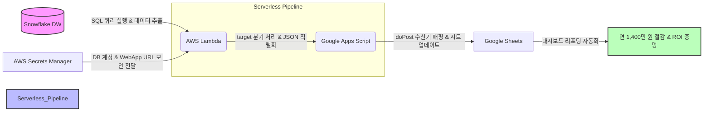

# 📊 01-3. GAS Data Pipeline — Snowflake to Google Sheets 서버리스 자동화

> **"SaaS 연간 1,400만 원 구독 비용을 100% 절감하고, 리텐션/코호트 지표의 실시간 연동
> 파이프라인을 구축한 서버리스 프로젝트입니다."**

---

## 🤔 왜 이걸 시작했나

Snowflake DB에 쌓이는 주요 리텐션·지표 데이터를 구글 시트로 자동 적재하기 위해, 외부
SaaS 솔루션인 Coefficient에 견적을 문의했습니다. 돌아온 답변은 "Snowflake 커넥터는
프리미엄 기능이라 최소 연 $10,000(약 1,380만 원) 패키지를 결제해야 한다"는 것이었습니다.

데이터 몇 개를 시트로 옮기는 데 연간 1,400만 원 가까운 돈을 쓰는 건 말이 안 된다고
판단했습니다. "이 정도는 AWS Lambda와 Google Apps Script 조합으로 직접 서버리스
파이프라인을 짜서 비용 0원으로 만들 수 있다"는 확신과 오기로, 하루 만에 이 프로젝트를
구축했습니다.

---

## 💡 프로젝트 배경 및 핵심 성과

### 1. 해결하고자 한 문제
- **고비용 유료 커넥터(SaaS) 부담**: Snowflake 데이터를 Google Sheets로 실시간 연동하기 위한 유료 SaaS(Coefficient 등) 도입 시, 엔터프라이즈 요금제 필수 적용으로 인해 연간 약 $10,000 USD(한화 약 1,400만 원) 이상의 고정 인프라 비용이 요구되었습니다.
- **수작업 리포팅의 비효율성**: 주/월 단위 리텐션 분석을 위해 담당자가 대용량 SQL 쿼리를 직접 수행하고 수동으로 스프레드시트에 이동·가공하는 반복적인 공수가 발생했습니다.

### 2. 서버리스 아키텍처 도입을 통한 해결
- **AWS Lambda + GAS 서버리스 구성**: 추가 인프라 유지비 없는 완전 서버리스(Serverless) 아키텍처를 직접 설계하여 AWS Free Tier 범위 내 $0 비용으로 완전 자동화를 달성했습니다.
- **동적 Target 파라미터 분기**: 단일 Lambda 함수 내에서 `target` 파라미터 분기 처리를 구현하여, 특정 리텐션 지표 탭 개별 업데이트 및 전체 지표 일괄 업데이트를 유연하게 제어하도록 설계했습니다.

### 3. 왜 이 조합(AWS Lambda + GAS)이었나 — 대안과의 비교

Coefficient를 배제한 뒤에도, 자체 구축 방법 안에서 몇 가지 선택지를 검토했습니다.

| 대안 | 특징 | 채택하지 않은 이유 |
|---|---|---|
| **리버스 ETL SaaS** (Hightouch, Census 등) | Coefficient보다 저렴할 수 있고 관리형이라 유지보수 부담 적음 | 결국 월 구독료가 발생한다는 점에서 Coefficient를 배제한 이유(비용)와 동일한 문제가 반복됨 |
| **Google Cloud Functions + Apps Script** | GAS와 같은 Google 생태계라 연동이 더 자연스러울 수 있음 | 데이터가 이미 AWS(Snowflake 접속, Secrets Manager)에 있는 상황이라, 굳이 다른 클라우드를 추가로 들여올 이유가 없었음. 같은 서버리스 함수라면 이미 쓰고 있던 AWS Lambda가 자연스러운 선택 |
| **Airbyte 커넥터로 Google Sheets 직접 연동** | 이미 사내에 Airbyte가 구축되어 있어(Snowflake sync에 실제 사용 중) 인프라 재사용 가능성을 실제로 검토함 | Airbyte의 목적지 커넥터는 원본 테이블을 그대로 옮기는 방식이라, 리텐션 코호트 계산처럼 집계·가공이 필요한 로직을 중간에 넣기 어려움 |

**결론**: AWS Lambda는 이미 사내에서 검증된 서버리스 환경(Secrets Manager 연동, IAM 정책)을
그대로 재사용할 수 있었고, GAS는 Google Sheets에 무료로 내장된 `doPost` 웹훅 수신
기능을 그대로 활용할 수 있어 별도 인프라 비용 없이 "계산 로직(Lambda) + 수신 및 표시(GAS)"
역할을 명확히 분리하는 가장 마찰 없는 조합이었습니다.

> **한 줄 요약**: 이미 있는 AWS 인프라를 재사용하면서, 사용 패턴(가끔 짧게 실행)에 맞는 비용 구조를 골랐습니다.

### 3. 프로젝트 주요 성과 (ROI)
- **💰 연 1,400만 원 비용 절감 (ROI 100% 증명)**: 외부 유료 SaaS 도입 대비 인프라 구축 비용을 100% 절감하여 연간 1,400만 원의 고정비 다이어트를 성취했습니다.
- **⚡ 리텐션 지표 자동 업데이트 파이프라인 완성**: 구독/자유 유저별 클래식 및 갱신 리텐션 지표 6종이 매주 Google Sheets 대시보드로 자동 전송되어, 타 팀과의 데이터 공유 및 현황 파악 생산성이 크게 향상되었습니다.

---

## 🏗️ 시스템 아키텍처

---

## 🛠️ Troubleshooting: 컨테이너 기반 Lambda 배포 및 실행 오류 해결

1. **시도 A (모듈 경로 및 핸들러 수정)**: 배포 직후 `ImportModuleError`가 발생했습니다. Lambda 컨테이너가 실행 파일을 패키지 디렉토리로 오인하는 문제였고, `Dockerfile`의 실행 커맨드를 실제 파일명에 맞게 수정하여 올바른 진입점을 매핑했습니다.
2. **시도 B (크로스 플랫폼 빌드 및 캐시 무효화)**: 로컬(Mac)과 AWS Lambda(Linux) 간의 아키텍처 불일치를 해결하고자 도커 빌드 시 `--platform linux/amd64`, `--provenance=false`, `--no-cache` 옵션을 강제하여 호환성을 확보했습니다.
3. **시도 C (최종 반영 파이프라인 정립)**: 이미지를 ECR에 Push했음에도 Lambda가 과거 코드를 실행하는 이슈가 있었습니다. 컨테이너 기반 Lambda는 ECR 업데이트를 자동으로 감지하지 않음을 파악하고, Lambda 콘솔에서 명시적으로 새 이미지 배포를 트리거하는 프로세스를 정립하여 파이프라인을 완성했습니다.

---

## 🛠️ Tech Stack

`AWS Lambda` `AWS Secrets Manager` `Google Apps Script` `Snowflake` `Docker` `Python`
