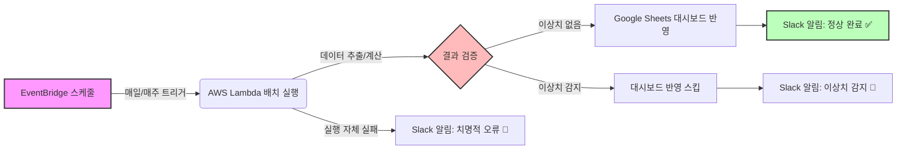

# 🔔 배치 파이프라인 실패·이상치 자동 감지 및 Slack 알림 시스템

리텐션·물량 예측·유저 클러스터링 등 여러 AWS Lambda 배치 파이프라인에 **사후 대응형
장애 확인**을 **사전 감지형 자동 알림**으로 전환한 프로젝트입니다. 단순 실행 성공/실패
알림을 넘어, 결과 데이터 자체의 이상치(row 0건, 음수 예측값, 이상 급변 등)까지 감지해
"실행은 됐지만 값이 이상한" 케이스까지 잡아내도록 설계했습니다.

---

## 🤔 왜 이걸 시작했나

이것도 처음부터 거창하게 설계하고 시작한 프로젝트는 아니었습니다. 시작은 아주 현실적인
불편함이었습니다.

사내에는 이미 Airbyte → Snowflake 적재 파이프라인에 문제가 생기면 Slack으로 알려주는
알림 체계가 있었습니다(제가 만든 건 아니고, 원래 있던 것이었습니다). 그런데 정작 제가
직접 배치로 돌려놓은 Lambda 파이프라인들(예: 매주 리텐션·지표를 계산해 Google Sheets
대시보드에 올리는 배치)에는 이런 알림이 없었습니다.

문제가 실제로 드러난 건 매주 월요일 정기 지표 회의에서였습니다. 배치가 새벽에 자동으로
돌아서 대시보드 값을 갱신해두는 구조였는데, 회의를 주최하시는 사업개발실장님이 매번
"이 값 이번 주 걸로 갱신된 거 맞나요?"라고 물어보셨습니다. 그러면 저는 그때마다 CloudWatch
로그를 직접 열어서 배치가 제대로 돌았는지, 에러는 없었는지 확인한 다음에야 답을 드릴 수
있었습니다. 매주 반복되는 이 과정이 비효율적이라고 느끼던 차에, 이미 사내에 있던
Airbyte→Snowflake Slack 알림 체계가 떠올랐습니다. "저것과 똑같은 걸 내 배치에도 붙이면
되겠다"는 생각으로 시작한 게 이 프로젝트입니다.

그리고 실제로 만들면서, 단순히 "성공/실패"만 알리는 걸로는 부족하다는 걸 깨달았습니다.
배치가 에러 없이 "성공"으로 끝나도, 그 안의 데이터가 비정상(예: 원본 API 일부 누락, 예측치
음수, row 수 급감)일 수 있다는 걸 이전 장애 대응 경험을 통해 알고 있었기 때문에, 여기에
**결과 데이터 자체를 검증하는 로직**까지 추가로 설계했습니다.

---

## 💡 프로젝트 배경 및 성과

### 1. 해결하고자 한 문제
- **사후 확인의 반복**: 배치 성공 여부를 매주 사람이 직접 로그를 열어 확인해야 했음
- **"성공"과 "정상"의 괴리**: 에러 없이 끝났어도 결과 데이터 자체가 이상할 수 있는데, 이를 감지할 장치가 없었음

### 2. 설계 방향
- 기존 Airbyte→Snowflake 알림 패턴을 참고해, 자체 Lambda 파이프라인에도 동일한 Slack Webhook 알림 체계 이식
- 여기서 그치지 않고, 파이프라인별 특성에 맞는 **결과 데이터 검증 로직**을 추가 설계 (아래 표 참고)

### 3. 왜 커스텀 Slack 알림이었나

사실 특별한 도구 검토 과정이 있었다기보다는 훨씬 단순한 이유였습니다. 회사는 이미
Slack을 업무 도구로 쓰고 있었고, Airbyte→Snowflake 적재 알림이 오는 채널이 이미
존재했습니다. 새로운 모니터링 도구를 도입하기보다, **이미 다들 보고 있는 그 채널에
제 파이프라인 알림도 함께 모으는 것**이 가장 자연스럽고 빠른 방법이었습니다. Datadog,
PagerDuty 같은 전문 모니터링 도구는 검토할 필요도 없었습니다 — 규모(개인이 관리하는
배치 소수)에 비해 명백히 과했기 때문입니다.

굳이 짚어볼 가치가 있는 대안은 하나뿐이었습니다.

| 대안 | 특징 | 이번엔 채택하지 않은 이유 |
|---|---|---|
| **dbt test / source freshness** | 데이터 품질 검증의 정석적인 방법 (03번 프로젝트에서 실제 사용) | 이 파이프라인들은 dbt 모델이 아니라 Lambda가 직접 SQL을 실행해 계산·적재하는 구조라 애초에 적용 대상이 아니었습니다. 만약 Lambda가 직접 모델을 계산하는 방식이 아니라 dbt로 변환 로직을 관리하는 구조였다면, 개별 알림 코드를 짜는 대신 dbt test 하나로 통합 관리하는 편이 더 나았을 것입니다. |

> **한 줄 요약**: 새 도구를 찾기보다, 이미 다들 보고 있는 채널(Airbyte 알림방)에 제 파이프라인 알림도 합치는 게 가장 빠르고 자연스러운 방법이었습니다.

### 3. 프로젝트 성과
- **주간 수동 확인 프로세스 제거**: 회의 전 CloudWatch 로그를 직접 열어보던 과정을 Slack 알림으로 대체
- **"성공했지만 이상한" 케이스 사전 포착**: 단순 에러 알림을 넘어, 아래와 같은 이상치 조건을 파이프라인 유형별로 설계해 결과 자체의 신뢰도 확보

| 파이프라인 유형 | 감지하는 이상치 |
|---|---|
| 리텐션/지표 집계 | row 0건, 특정 컬럼 0 이하 값 |
| 수요 예측(Prophet) | 외부 API 일부 지역 데이터 누락, 예측값 음수, 최근 평균 대비 급변(N배 이상) |
| 유저 클러스터링(GMM) | 유저 수 급감, 군집 수(K)가 탐색 범위 경계에 위치, 특정 군집 쏠림(50% 이상) |

---

## 🏗️ 시스템 아키텍처



---

## 💻 Core Code Snippet

파이프라인마다 성공/실패만 판단하는 게 아니라, **결과 데이터 자체를 검증하는 함수**를
공통 패턴으로 만들어 재사용했습니다. 아래는 리텐션 집계 파이프라인에 적용한 예시입니다.

```python
def send_slack_alert(webhook_url, message, is_error=True):
    """Slack Webhook으로 파이프라인 상태 알림을 전송합니다."""
    if not webhook_url:
        print("[WARNING] Slack Webhook URL이 설정되지 않아 알림을 건너뜁니다.")
        return

    emoji = "🚨" if is_error else "✅"
    payload = {"text": f"{emoji} [Pipeline Alert] {message}"}

    try:
        resp = requests.post(webhook_url, data=json.dumps(payload), timeout=10)
        if resp.status_code != 200:
            print(f"[WARNING] Slack 알림 전송 실패: status={resp.status_code}")
    except Exception as e:
        # Slack 알림 자체의 실패가 메인 파이프라인을 죽이지 않도록 방어
        print(f"[WARNING] Slack 알림 전송 중 예외 발생: {str(e)}")


def check_data_quality(target, df):
    """
    '성공'과 '정상'을 구분하기 위한 최소한의 결과 데이터 검증.
    - row가 0건이면: 원본 데이터 소스나 필터 조건에 문제가 있을 가능성
    - 핵심 지표 컬럼에 비정상 값(0 이하 등)이 섞여 있으면 이상 신호
    반환값: (is_healthy: bool, message: str)
    """
    row_count = len(df)
    expected_min = MIN_EXPECTED_ROWS.get(target, 1)

    if row_count == 0:
        return False, f"target='{target}' 결과가 0건입니다."
    if row_count < expected_min:
        return False, f"target='{target}' row 수({row_count}건)가 기대치보다 적습니다."
    if "핵심지표" in df.columns and (df["핵심지표"] <= 0).any():
        return False, f"target='{target}' 핵심 지표에 비정상 값이 포함되어 있습니다."

    return True, f"target='{target}' 정상 ({row_count}건)"
```

> **[Security Notice]** 실제 시크릿 이름, 테이블명, 임계값은 보안 규정에 따라 마스킹 처리했습니다.
> 전체 코드는 `lambda_function_masked.py` 참고.

---

## 🛠️ Troubleshooting

### 1. Slack Webhook 발급 시 사내 워크스페이스 관리자 승인 필요
- **문제**: Slack App 생성 후 Incoming Webhook을 추가하려 하자 "Request to Add New Webhook" 문구와 함께 관리자 승인 절차가 요구됨
- **해결**: 워크스페이스 관리자에게 승인 요청 후 정상 발급. 이후 Webhook URL은 코드에 하드코딩하지 않고 AWS Secrets Manager에 등록해 관리

### 2. 컨테이너 기반 Lambda의 진입점(Entrypoint) 불일치
- **문제**: Dockerfile의 `CMD`를 새 파일명에 맞게 수정했음에도 `Runtime.InvalidEntrypoint` 에러가 반복 발생
- **원인 규명**: `docker inspect`로 이미지의 실제 `Cmd` 값을 확인한 결과, `--no-cache` 없이 빌드해 Docker가 이전 레이어(예전 CMD)를 그대로 재사용하고 있었음을 확인
- **해결**: `--platform linux/amd64 --provenance=false --no-cache` 옵션을 포함해 재빌드, `docker inspect`로 실제 반영 여부를 매번 검증하는 절차를 확립

### 3. 알림 로직 자체의 실패가 파이프라인을 중단시키는 문제 방지
- **문제**: 초기 설계에서는 Slack 전송 실패 시 예외가 그대로 전파되어 메인 로직까지 중단될 위험이 있었음
- **해결**: `send_slack_alert` 함수 내부에 try/except를 별도로 감싸, 알림 전송 실패가 절대 메인 파이프라인 실행에 영향을 주지 않도록 방어적으로 설계

---

## 🛠️ Tech Stack

`AWS Lambda` `AWS Secrets Manager` `AWS CloudWatch` `Slack Incoming Webhook` `Python` `Docker`
