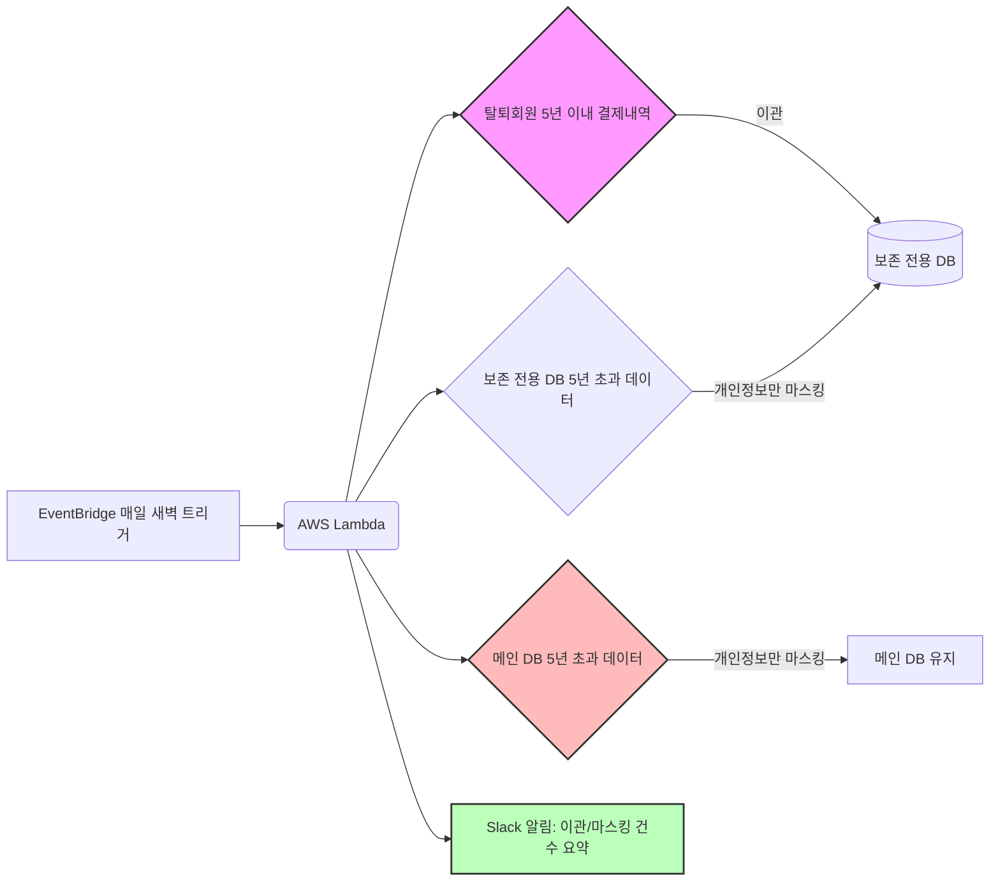

# 🔐 01-5. 개인정보 보존기간 관리 배치 (ISMS 대응)

---

## 🤔 왜 이걸 시작했나

ISMS(정보보호 관리체계) 인증 심사를 준비하는 과정에서, 탈퇴 회원의 결제 내역을
"5년간 보존 후 파기"해야 한다는 요건이 있다는 걸 알게 됐습니다. 이건 순수 분석·엔지니어링
업무와는 결이 다른, DBA·개인정보보호 영역의 일이었지만, 사내에 별도 DBA가 없는 상황이라
데이터를 다루는 제가 직접 설계·구현까지 맡게 됐습니다.

---

## 💡 프로젝트 배경

### 1. 해결하고자 한 문제
- 탈퇴 회원의 결제 내역(개인정보 포함)을 무기한 보관하는 건 개인정보보호법·ISMS 요건 위반 소지가 있었습니다.
- 그렇다고 결제 기록 자체를 통째로 삭제하면, 회계·정산·분쟁 대응에 필요한 거래 이력까지 사라지는 문제가 있었습니다.
- 즉 "개인을 식별할 수 있는 정보만 제거하고, 거래 사실 자체는 남겨야" 하는 정교한 처리가 필요했습니다.

### 2. 설계 방향
- 메인 DB 부담을 줄이기 위해 **보존 전용 복제 DB(replica)**를 신설했습니다.
- 매일 새벽 배치로 다음 3단계를 수행합니다.
  1. 탈퇴 회원의 최근 5년 이내 결제 내역을 보존 전용 DB로 이관
  2. 메인 DB에서 탈퇴 후 5년이 지난 결제 건은 이름·이메일·전화번호만 마스킹 (거래 기록 자체는 유지)
  3. 보존 전용 DB에서도 동일하게 5년 초과 건을 마스킹
- **현역 회원 데이터는 절대 건드리지 않도록** `deleted_at IS NOT NULL` 조건을 모든 단계에 명시했습니다.

---

## 🏗️ 시스템 아키텍처

---

## 📊 성과

- ISMS 인증 심사에서 요구하는 개인정보 보존기간 준수 체계를 매일 자동으로 실행되는 배치로 구축해, 수동 점검 없이도 지속적으로 요건을 충족하는 상태를 유지했습니다.
- 거래 기록(결제 금액, 품목 등)은 보존하면서 개인 식별 정보만 선택적으로 제거하는 방식으로, 회계·정산 데이터의 연속성과 개인정보 규정 준수를 동시에 만족시켰습니다.
- 배치 성공/실패 및 이관·마스킹 처리 건수를 Slack으로 자동 리포트해, 별도 확인 없이도 매일 처리 현황을 파악할 수 있게 했습니다.

---

## 🛠️ Troubleshooting

### 멱등성(Idempotency) 확보
- **문제**: 배치가 실패 후 재실행되거나 특정 구간을 재처리할 경우, 동일한 결제 건이 보존 전용 DB에 중복 이관될 위험이 있었습니다.
- **해결**: `INSERT ... ON DUPLICATE KEY UPDATE id=id` 패턴을 적용해, 이미 이관된 행은 조용히 건너뛰고 신규 행만 추가되도록 처리했습니다.

### 현역 회원 데이터 오염 방지
- **문제**: 마스킹 대상 조건을 잘못 설계하면 탈퇴하지 않은 현역 회원의 정보까지 지워질 치명적 위험이 있었습니다.
- **해결**: 모든 UPDATE/SELECT 쿼리에 `deleted_at IS NOT NULL` 조건을 명시적으로 포함시키고, 실행 전 별도 환경에서 영향받는 행 수를 먼저 확인하는 절차를 거쳤습니다.

### 부분 실패 시 데이터 정합성
- **문제**: 이관은 성공했는데 마스킹 단계에서 실패하면, 두 DB의 상태가 서로 어긋날 수 있었습니다.
- **해결**: 각 DB 커넥션 단위로 예외 발생 시 rollback을 수행하고, 실패 내용을 Slack으로 즉시 알려 수동 재처리가 필요한지 빠르게 판단할 수 있게 했습니다.

---

## 🛠️ Tech Stack

`AWS Lambda` `AWS Secrets Manager` `PyMySQL` `Slack Webhook` `Python`
