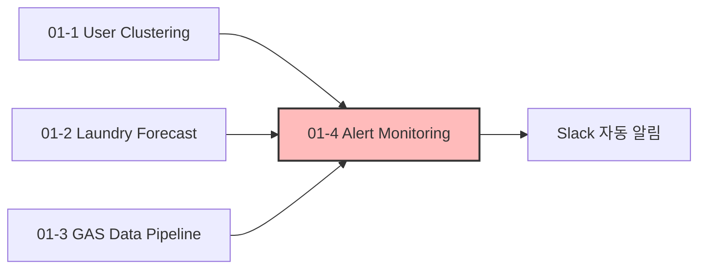

# 🤖 01. MLOps — 서버리스 ML 파이프라인 구축 및 신뢰성 확보

세탁 서비스 운영에 필요한 두 가지 머신러닝 파이프라인(유저 클러스터링, 수요 예측)을
AWS Lambda 기반 서버리스 환경에서 자동화하고, 그 결과를 Google Sheets 대시보드로
서빙한 뒤, 마지막으로 이 모든 파이프라인이 "제대로 돌았는지"를 사람이 매번 확인하지
않아도 되도록 자동 감지 체계까지 구축한 일련의 프로젝트입니다.

4개 프로젝트를 순서대로 보시면, ML 모델을 처음 서비스에 붙이는 단계부터 시작해서
운영 신뢰성을 확보하기까지의 흐름을 보실 수 있습니다.

---

## 📂 하위 프로젝트

### [01-1. User Clustering](./01-1_USER_CLUSTERING)
`GMM` `AIC 기반 K 자동탐색` `MLOps`

VIP 고객 이탈 방어를 위해 GMM(Gaussian Mixture Model) 기반 유저 클러스터링 파이프라인을
구축하고, 결과를 CRM(Braze) 및 현장 오퍼레이션 시스템에 리버스 ETL로 연동했습니다.

### [01-2. Laundry Forecast](./01-2_LAUNDRY_FORECAST)
`Prophet` `외부 API 연동` `시계열 예측`

기상청 API와 사내 물량 데이터를 결합한 Prophet 기반 수요 예측 파이프라인으로,
YoY 방식 대비 예측 오차를 약 70% 감소시켰습니다.

### [01-3. GAS Data Pipeline](./01-3_GAS_DATA_PIPELINE)
`AWS Lambda` `Google Apps Script` `비용 절감`

Snowflake의 리텐션·코호트 지표를 유료 SaaS 없이 서버리스로 Google Sheets에 자동
연동하여, 연간 약 1,400만 원의 구독 비용을 절감했습니다.

### [01-4. Pipeline Alert Monitoring](./01-4_PIPELINE_ALERT_MONITORING)
`Slack Webhook` `사전 감지형 DQ 모니터링`

위 세 파이프라인이 "에러 없이 실행됐다"와 "결과가 정상이다"가 다르다는 걸 운영하며
깨닫고, 실행 성공 여부뿐 아니라 결과 데이터 자체의 이상치까지 감지해 Slack으로
알리는 공통 모니터링 체계를 구축했습니다.

---

## 🗺️ 전체 흐름

세 파이프라인(01-1~01-3)을 각각 구축·운영하면서, "배치가 성공했다는 로그만으로는
결과를 신뢰할 수 없다"는 공통된 문제를 겪었습니다. 이를 해결하기 위해 01-4에서
파이프라인 전반에 적용 가능한 사전 감지 모니터링 체계를 별도로 설계했습니다.

---

## 🔧 그 밖에 대응해본 것

### Airbyte 버전업으로 인한 K8s 인증서 호환성 이슈 대응
Airbyte 버전을 업그레이드하는 과정에서 기존 K8s 클러스터 인증서가 새 버전과
호환되지 않아 Snowflake 적재가 일시 중단된 적이 있습니다. 데이터 엔지니어 부재
상황에서 원인을 인증서 버전 불일치로 특정하고, 호환 가능한 버전으로 맞춰 재기동하여
데이터 유실 없이 복구했습니다.

