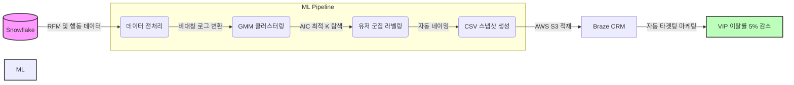

# 👥 유저 클러스터링 및 CRM 타겟팅 자동화 파이프라인

유저 행동 지표를 분석해 고객 페르소나를 정의하고, GMM 모델과 자동 네이밍 시스템으로 마케팅을 자동화하는 머신러닝 파이프라인입니다. AWS Lambda와 Snowflake를 연동해 매월 서버리스 환경에서 구동됩니다.

---

## 💡 비즈니스 배경 및 성과

### 1. 해결하고자 한 문제
- **핵심 고객 이탈 방어:** 고매출 상위 유저의 이탈과 관련 VoC 증가를 선제적으로 방어할 데이터 기반 관리가 필요했습니다.
- **마케팅 시스템화:** 기존의 직관적인 단발성 마케팅을 넘어, 행동 데이터 기반의 구체적인 타겟팅 세그먼트를 구축하고자 했습니다.

### 2. GMM 모델을 채택한 이유
- **K-Means 배제:** 아웃라이어가 많은 다차원 데이터 환경에서 구형 군집의 한계로 분류 정확도가 저하되었습니다.
- **HDBSCAN 배제:** 매출 상위 유저들이 노이즈로 대거 유실되는 치명적 결함이 있었습니다.
- **GMM 채택:** 타원형 공분산 구조를 통해, 넓게 퍼진 아웃라이어 유저 데이터까지 노이즈 없이 포용할 수 있어 최종 채택했습니다.

### 3. 프로젝트 성과
- **VIP 유저 이탈률 5% 감소:** 선제적 타겟팅을 통해 작년 4분기 대비 올해 1분기 이탈률을 낮추는 데 성공했습니다.
- **CRM 연동 및 타겟팅 자동화:** 군집 데이터를 사내 CRM(Braze)과 연동하여, 마케터가 별도 데이터 추출 없이 즉각적으로 타겟팅할 수 있는 환경을 구축했습니다.

---

## 🏗️ 시스템 아키텍처 (Workflow)



---

## 💻 Core Code Snippet

단순히 하드코딩된 K값을 사용하는 것을 넘어, 매월 변동하는 데이터 볼륨에 맞춰 **최적의 군집 수(K)를 동적으로 탐색하는 로직**을 구현했습니다. 

GMM(Gaussian Mixture Model)을 학습시키고, 모델의 정보 손실량(AIC) 기울기가 가장 급격하게 변하는 지점(Elbow Point)을 2차 차분(2nd Derivative)으로 자동 계산합니다.

```python
import numpy as np
from sklearn.mixture import GaussianMixture

# [핵심 로직] AIC 지표 기반 최적 군집 수(K) 자동 탐색
def find_best_k_by_aic_elbow(X, min_k=10, max_k=25):
    """AIC 2차 차분을 계산하여 오버피팅을 방지하는 엘보우 포인트를 찾습니다."""
    print(f"🔍 AIC 기반 최적 군집 수(K) 자동 탐색 중... (범위: {min_k} ~ {max_k})")
    k_range = range(min_k, max_k + 1)
    aic_scores = []
    
    # K값의 범위를 순회하며 GMM 모델의 AIC 스코어 계산
    for k in k_range:
        # covariance_type='full': VVIP 등 넓게 퍼진 아웃라이어를 타원형으로 포용
        gmm = GaussianMixture(n_components=k, covariance_type='full', random_state=42)
        gmm.fit(X)
        aic_scores.append(gmm.aic(X))
        
    # 2차 차분(기울기 변화량)을 통해 꺾이는 지점(Elbow) 탐색
    aic_diff1 = np.diff(aic_scores)
    aic_diff2 = np.diff(aic_diff1)
    
    # 변화량이 가장 큰 인덱스를 찾아 최적의 K로 산출
    elbow_index = np.argmax(aic_diff2)
    best_k = k_range[elbow_index + 1]
    
    print(f"🎯 AIC 엘보우 포인트 발견: 최적의 K = {best_k}")
    return best_k
```

---

## 🛠️ Troubleshooting: 컨테이너 기반 Lambda 배포 및 실행 오류 해결

Lambda를 컨테이너 이미지(Docker)로 배포하는 과정에서 발생한 모듈 인식 및 버전 충돌 문제를 다음 3단계의 시도를 거쳐 해결했습니다.

1. **시도 A (모듈 경로 및 핸들러 수정):** 배포 직후 `ImportModuleError`가 발생했습니다. 확인 결과 Lambda 컨테이너가 실행 파일을 패키지 디렉토리로 오인하는 문제였습니다. `Dockerfile`의 실행 커맨드를 `app.py.lambda_handler`에서 `app.lambda_handler`로 수정하여 올바른 진입점을 매핑했습니다.
2. **시도 B (크로스 플랫폼 빌드 및 캐시 무효화):** 패키지 버전이 꼬이는 현상을 방지하기 위해 로컬 캐시를 무시했습니다. 또한, 로컬(Mac)과 AWS Lambda(Linux) 간의 아키텍처 불일치를 해결하고자 도커 빌드 시 `--platform linux/amd64`, `--provenance=false`, `--no-cache` 옵션을 강제하여 호환성을 확보했습니다.
3. **시도 C (최종 반영 파이프라인 정립):** 이미지를 ECR에 Push했음에도 Lambda가 과거 코드를 실행하는 이슈가 있었습니다. 컨테이너 기반 Lambda는 ECR 업데이트를 자동으로 감지하지 않음을 파악하고, 최종적으로 Lambda 콘솔에서 명시적으로 [새 이미지 배포]를 트리거하는 프로세스를 정립하여 파이프라인을 완성했습니다.