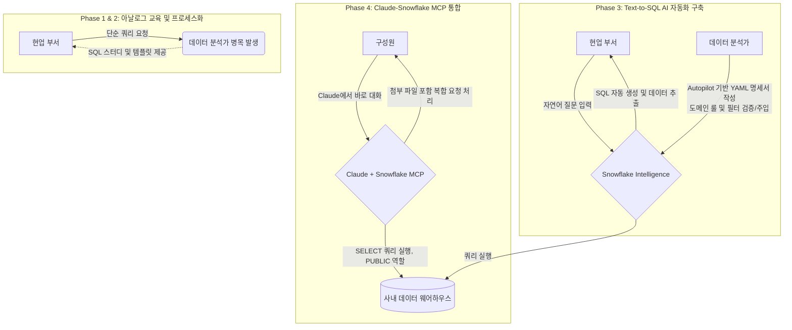

# 📊 02. DataOps & Text-to-SQL — 사내 데이터 리터러시 향상 프로젝트

---

## 🤔 왜 이걸 시작했나

사내 유일한 데이터 담당자로서, 단순 데이터 추출·쿼리 요청이 저에게 계속 몰리는 구조였고
이게 병목이 되고 있었습니다. 언젠가는 이 요청들을 자동화해야 한다고 판단했는데, 자동화를
구축하더라도 사용자가 결과물을 받았을 때 그 쿼리가 어떤 의미로 짜여진 건지 최소한은
이해할 수 있어야 한다고 생각했습니다.

만약 이해하지 못한다면 결국 저에게 다시 확인을 요청할 것이고, 그 확인을 기다리는 시간이
또 발생하며, 제 리소스도 똑같이 소모될 게 뻔했습니다. 남이 짠 쿼리를 읽고 해석하는 건
직접 짜는 것보다 훨씬 어렵기 때문입니다. 쉬운 쿼리는 직접 짜서 쓸 수 있으면 가장 좋지만,
적어도 자동화된 결과물의 구조와 의미 정도는 스스로 해석할 수 있는 조직을 만들고 싶었고,
그게 이 프로젝트의 시작이었습니다.

---

## 💡 프로젝트 배경 및 성과

"아날로그(교육) ➔ 프로세스(가이드) ➔ AI 자동화(Text-to-SQL)" 3단계 빌드업을 통해
구성원 스스로 데이터를 분석하는 Self-Serve Analytics 환경을 구축했습니다.

### 1. 해결하고자 한 문제
- 사내 유일한 분석가 체제로 인한 전사 데이터 추출·가공 요청 병목, 이로 인한 의사결정 지연
- 자동화 도입 이전에, 구성원들이 결과물을 최소한이라도 스스로 해석할 수 있는 기반 필요

### 2. 단계별 수행 내용

**Phase 1~2. 사내 SQL 스터디 및 프로세스화 (아날로그 → 프로세스)**
- PM, 프로덕트 디자이너, CRM 마케팅 등 실무에서 데이터를 다루는 전 직군 대상, 총 12명 참여로 SQL 스터디를 진행했습니다.
- 가장 많이 요청받던 주제를 기준으로 재사용 가능한 쿼리 템플릿을 만들었습니다: 수거신청당 발생한 결제 항목 조회, 특정 기간 특정 품목을 맡긴(또는 맡기지 않은) 유저 추출, 특정 쿠폰 사용 유저의 평균 구독 유지기간·결제금액·세탁 건수 조회 등이 대표적이었습니다.
- 이 과정에서 트래킹에 필요한 핵심 테이블 구조(예: 수거신청당 서비스 이용금액/스토어 결제금액 RD)를 굵직하게 정리했습니다.

**Phase 3. Snowflake Intelligence 기반 Text-to-SQL 에이전트 구축 (AI 자동화)**
- Cortex Analyst를 구축하는 과정에서 Snowflake Autopilot을 활용해 DB 히스토리와 주요 쿼리들을 학습시켰습니다.
- 별도의 메타데이터가 사전에 존재하지 않았기 때문에, 기존에 자주 쓰이던 쿼리문을 기반으로 Autopilot이 생성한 데이터 명세서를 초안으로 삼았습니다.
- 이 초안을 테이블별로 하나씩 검토하며 날짜 기준(KST/UTC 구분), 세탁 테이블 상태값 필터(`status not in (4, 17)`) 등 실제 비즈니스 조건을 반영해 수정했습니다.

### 2-1. 왜 Snowflake Intelligence였나

실제로 먼저 시도했던 방법은 자체 벡터DB 구축이었습니다. 기존 쿼리들을 모아 벡터DB에
넣어보려 했지만, 메타데이터 정비와 임베딩 관리를 동시에 수작업으로 진행하려니 속도가
너무 느렸습니다.

그러던 중 Snowflake가 Autopilot을 출시했고, 이게 정확히 수작업으로 하던 일(기존 쿼리
기반 명세서 자동 생성)을 대체할 수 있는 기능이었습니다. 게다가 회사는 이미 Snowflake
위에서 대시보드와 Streamlit 앱을 운영하고 있었고, 사용 가능한 토큰(크레딧)에도 여유가
있었습니다. 별도 벡터DB나 외부 LLM 파이프라인을 새로 구축하지 않고, 같은 웨어하우스
안에서 권한 체계를 그대로 상속받아 해결할 수 있다는 점이 방향을 전환한 핵심 이유였습니다.

> **한 줄 요약**: 자체 벡터DB는 느려서 막혀 있었는데, 마침 Snowflake Autopilot이 나왔고 이미 Snowflake로 대시보드·Streamlit을 운영 중이라 토큰 여유도 있어 자연스럽게 이걸 택했습니다.

### Phase 4. Claude-Snowflake 직접 연동으로 AI 채널 통합

Cortex Analyst 기반 Text-to-SQL은 잘 작동했지만, 회사가 전사적으로 유료 결제해
쓰고 있는 Claude와는 별개의 채널이었습니다. 대화 중 "이 데이터 첨부해줘" 같은
요청이 오면, Snowflake Cowork에서 데이터를 뽑아 다운받은 뒤 다시 Claude에
업로드하는 번거로운 과정을 거쳐야 했습니다. 게다가 Snowflake Cowork는 멀티모달에
약해서, 사진이나 다른 파일을 첨부하면 제대로 읽지 못하는 한계도 있었습니다.

이를 해결하기 위해 Claude에 Snowflake MCP 커넥터를 연동해, Claude와 대화하는
중에 바로 Snowflake 쿼리를 실행하고 결과를 받아오도록 AI 채널을 하나로
통합했습니다. 연동 시 Snowflake 역할을 PUBLIC(조회 전용)으로 스코프해, MCP를 통한
접근은 SELECT만 가능하도록 제한하고 DDL/DML은 ACCOUNTADMIN 역할을 가진 본인만
수행할 수 있도록 분리했습니다.

기존에는 "Snowflake Cowork에서 뽑기 → 클로드에 넣기"로 나뉘어 있던 흐름이
Claude 안에서 한 번에 처리되면서, 데이터 조회부터 첨부 파일이 섞인 복합적인 요청까지
하나의 채널에서 자연스럽게 이어지게 됐습니다.

### 3. 프로젝트 성과

| 시점 | 단순 데이터 추출 요청 빈도 (평균) |
|---|---|
| 2025년 1분기 | 주 24회 |
| 2026년 1분기 | 주 18회 |
| 2026년 2분기 | 주 6회 |

- 스터디 참여 인원 12명을 시작으로, 이후 실무자들이 직접 데이터 마트에 접근하고 가공할 수 있는 자생적 데이터 분석 환경이 정착됐습니다.
- 단순 요청 대응에 쓰이던 시간이 줄면서, 분석가 본연의 고도화 업무에 집중할 수 있는 여력이 확보됐습니다.
- Claude-Snowflake MCP 연동 이후로는 데이터 조회 자체가 대화형으로 통합되어, 별도 채널을 오가는 과정 자체가 사라졌습니다.

---

## 🏗️ 시스템 아키텍처 (데이터 분석 파이프라인 진화도)



---

## 📖 실제 사례: 요금제-품목 단가 매칭 룰 (Autopilot 명세서 검토 사례)

회사에서 중점적으로 보는 데이터는 세탁·품목 테이블과 결제 테이블입니다. 서비스는
자유이용/구독요금제 2가지 결제 구조가 혼재되어 있는데, 자유 요금제는 세탁 건마다
필수 결제가 발생하는 반면 구독 요금제는 월 단위로 세탁권을 선불 구매한 뒤 품목에 따라
차감되는 구조라 **세탁 건과 결제 건이 1:1로 매칭되지 않습니다.**

프로덕트 담당자가 특정 월의 품목별 결제 현황을 조회하려 해도, 품목과 구독 요금제의
세탁권 단가를 매칭하는 방법은 사내에 별도 문서화가 안 되어 있어 AI도 사전 정의 없이는
추론할 수 없는 영역이었습니다. 이 매칭 규칙(`laundry_plan_item` × `wash_item`을
`subtract_category` 기준으로 JOIN)을 명세서에 명시적으로 정의해 추가했습니다.

> 해당 로직을 반영한 시맨틱 모델 예시는 [`wash_item_subscription_matching_model.yaml`](./02_Text_to_SQL_Agent/wash_item_subscription_matching_model.yaml)에 정리되어 있습니다.

이런 규칙을 전사 공지 형태로 배포하는 방법도 있었지만, 특히 재무·경영지원 팀처럼
쿼리·데이터 리터러시가 상대적으로 낮은 부서는 이 조인 규칙을 스스로 활용하기 어려웠습니다.
그래서 문서 전파 대신, 누구든 자연어로 질문하면 이 규칙이 자동 반영된 결과를 받을 수
있는 AI 툴(Snowflake Intelligence) 도입을 선택했습니다.

---

## 🛠️ Troubleshooting

### 메타데이터 부재 문제
- **문제**: 프로젝트 시작 시점엔 테이블 관계도나 비즈니스 룰이 문서화되어 있지 않아, AI가 참고할 명세 자체가 없었습니다.
- **1차 시도**: 기존 쿼리문을 기반으로 벡터DB를 직접 구축해 수동으로 명세를 만들려 했습니다.
- **전환**: 마침 Snowflake가 DB 히스토리와 주요 쿼리 학습을 지원하는 Autopilot 기능을 출시하면서, 자주 쓰이던 쿼리문을 기반으로 명세서 초안을 자동 생성하는 방식으로 전환했습니다. 이후 테이블 단위로 날짜 기준(KST/UTC), 상태값 필터 등을 사람이 검토·보정하는 하이브리드 방식으로 정착시켰습니다.

### 배포 현황
- Phase 3(Text-to-SQL)는 실제 운영에 배포되어 사용 중이며, Phase 4(Claude-Snowflake MCP 연동)까지 이어져 AI 채널이 하나로 통합된 상태입니다.

---

## 📁 프로젝트 구조

```
02_DataOps-Text-to-SQL-Project/
├── README.md
├── 01_SQL_Study_and_Templates/
│   └── SQL_STYLE_GUIDE.md              (사내 SQL 작성 가이드 / 마스킹된 쿼리 템플릿)
└── 02_Text_to_SQL_Agent/
    ├── cortex_semantic_model.yaml
    ├── wash_item_subscription_matching_model.yaml   (실제 사례 명세 샘플)
    └── images/                          (Agent 구축 예시, 실제 질의응답 캡처)
```

---

## 🛠️ Tech Stack

`Snowflake Cortex Analyst` `Snowflake Autopilot` `Snowflake Intelligence` `Claude` `MCP` `SQL`
