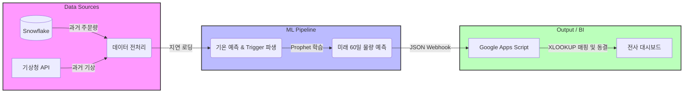

# 🧺 세탁 물량 수요 예측 자동화 파이프라인

날씨 변화(기온, 강수량)와 사내 물량 데이터를 결합하여 향후 60일간의 세탁 수요를 예측하고 대시보드(Google Sheets)에 자동 연동하는 머신러닝 파이프라인입니다. AWS Lambda와 Docker를 활용해 매일 새벽 서버리스 환경에서 구동됩니다.

---

## 💡 비즈니스 배경 및 성과

### 1. 해결하고자 한 문제
- **인력 운용의 딜레마:** 성수기/비수기 전환에 따른 팩토리(세탁 공장) 인력 운용의 비효율 및 본업 차질이 반복되었습니다.
- **직관의 정량화:** 날씨에 의존하던 실무자의 감(感) 중심 예상을 기상청 예보 데이터 기반의 정량적인 예측 수치로 변환하고자 했습니다.

### 2. Prophet 모델을 채택한 이유
- **XGBoost/LSTM 배제:** 1,000건 수준의 스몰 데이터 환경에서 과적합(Overfitting) 위험이 높았습니다.
- **ARIMA 배제:** 명절 등 물량이 급변하는 공휴일 효과 및 추세 변화점(Changepoints) 대응에 취약했습니다.
- **Prophet 채택:** 계절성(Seasonality) 반영에 강하며, 단기 기상 변화를 외부 회귀 변수(Regressor)로 손쉽게 결합할 수 있어 최종 선택했습니다.

### 3. 프로젝트 성과
- **예측 오차(MAE) 약 70% 감소:** 일 평균 240건이던 예측 오차를 **일 평균 76건**으로 대폭 축소하는 데 성공했습니다.
- **현장 자원 최적화:** YoY 평균 방식에서 벗어나, 최근 트렌드와 기상을 반영해 팩토리 인력을 효율적으로 배치하게 되었습니다.

---

## 🏗️ 시스템 아키텍처 (Workflow)




---

## 💻 Core Code Snippet

단순히 과거 날씨 데이터를 그대로 사용하는 것을 넘어, 1차 시계열 예측을 통해 **향후 60일의 미래 기온 변화 트렌드를 선제적으로 파악하는 파생 변수 생성 로직**을 구현했습니다.

권역별 미래 기온을 예측한 뒤 전주 대비 기온 변화(1도/2도/3도) 수준을 계산하고, 비즈니스 영향도가 발생하는 다중 임계값(Trigger) 조건을 추출하여 메인 수요 예측 모델의 외부 회귀 변수(Regressor)로 주입합니다.

```python
import pandas as pd

# [핵심 로직] 미래 기온 시뮬레이션 및 다중 임계값 Trigger 생성
def generate_weather_triggers(df_weather, predict_days=60):
    """
    1차 Prophet 모델로 권역별 미래 기온을 예측한 뒤, 
    전주 대비 기온 변화(1도/2도/3도)에 따른 외부 회귀 Trigger 피처를 생성합니다.
    """
    # AWS Lambda Init Timeout 회피를 위한 Lazy Loading 적용
    from prophet import Prophet
    
    future_weather_dict = {}
    
    # 1. 권역별 기온 예측 모델 적합
    for region in TARGET_STATIONS.values():
        df_temp = df_weather[df_weather['지역명'] == region][['날짜', '평균기온']].rename(columns={'날짜': 'ds', '평균기온': 'y'}).dropna()
        m_temp = Prophet(yearly_seasonality=True, daily_seasonality=False)
        m_temp.fit(df_temp)
        
        future_temp = m_temp.make_future_dataframe(periods=predict_days)
        forecast_temp = m_temp.predict(future_temp)
        
        # 과거 실제 기온 데이터와 미래 예측 yhat 합성
        future_weather_dict[region] = df_temp.set_index('ds')['y'].combine_first(forecast_temp.set_index('ds')['yhat'])

    # 2. 전주 대비(7일 차분) 기온 절대 변화량 계산
    df_temp_diff = pd.DataFrame(future_weather_dict).diff(periods=7).abs()
    
    # 3. 최소 2개 권역 이상에서 기온 급변 현상이 포착될 때 시스템 트리거 발동 (Binary Feature)
    return pd.DataFrame({
        'temp_trigger_1deg': ((df_temp_diff >= 1.0).sum(axis=1) >= 2).astype(int),
        'temp_trigger_2deg': ((df_temp_diff >= 2.0).sum(axis=1) >= 2).astype(int),
        'temp_trigger_3deg': ((df_temp_diff >= 3.0).sum(axis=1) >= 2).astype(int)
    }).reset_index()
```


## 🛠️ Troubleshooting: AWS Lambda 제약 및 데이터 휘발 이슈 해결

무거운 시계열 모델(Prophet)을 서버리스(AWS Lambda) 환경에서 안정적으로 운영하고 결과를 대시보드에 적재하기 위해 다음 문제들을 단계별로 해결했습니다.

1. **시도 A (Init Timeout 극복을 위한 Lazy Loading):** 
   - **문제:** `prophet`, `snowflake` 등 무거운 라이브러리를 전역(Global)에서 import하다 부팅 제한시간(10초)을 초과하는 현상 발생.
   - **해결:** `lambda_handler` 및 각 개별 함수 내부에서 호출하는 지연 로딩(Lazy Loading) 기법을 적용하여 초기 부팅 타임아웃을 회피함.

2. **시도 B (Read-Only 경로 충돌 및 백엔드 다운그레이드):** 
   - **문제:** 최신 Prophet의 C++ 컴파일러가 Lambda의 읽기 전용 코드 경로(`/var/task`)에 파일 쓰기를 시도하다 프로세스 강제 종료.
   - **해결:** `/tmp` 우회 시도 후, 최종적으로 디렉토리 쓰기 없이 메모리상에서만 동작하도록 **Python 3.8 + Prophet 1.1.1 + `pystan`** 환경으로 스택을 다운그레이드하여 안정성 확보.

3. **시도 C (데이터 휘발 방지 및 2-Tier 대시보드 구축):** 
   - **문제:** 매일 60일 치 예측 결과가 덮어씌워지며 과거 데이터가 휘발되는 리스크 존재.
   - **해결:** 데이터 수집용 시트(`raw_data`)와 전사 대시보드 시트를 분리하고, `=XLOOKUP` 매핑 및 GAS 시간 기반 트리거로 과거 데이터를 주 1회 값 고정(Freeze)하여 안정적인 누적 체계 완성.


   
