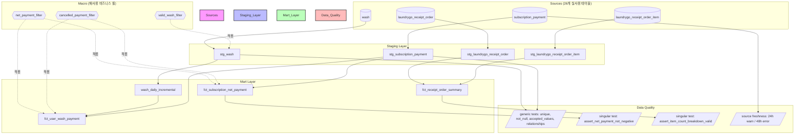

# 🧱 dbt 기반 Analytics Engineering 파이프라인 구축

실제 운영 중인 세탁 서비스(LAUNDRYGO) 데이터를 대상으로, 기존 SQL 문서 기반 거버넌스를
**코드로 강제되는 검증 체계**로 전환한 프로젝트입니다. dbt(Data Build Tool)를 도입해
세탁·결제·주문 3개 도메인의 staging-mart 파이프라인을 구축하고, 그 과정에서 실제
데이터 정합성 이슈를 발견·해결했습니다.

---

## 🤔 왜 이걸 시작했나

이 프로젝트를 처음부터 "dbt를 도입해야겠다"는 확신으로 시작한 건 아니었습니다.

사내 유일한 데이터 담당자로서, Snowflake Cortex Analyst용 시맨틱 모델(YAML)을 직접 만들어
Text-to-SQL 환경을 구축했고, 신규 입사자가 오면 이 YAML을 각자 쓰는 LLM 에이전트(Claude,
ChatGPT 등)에 넣어서 스키마를 파악하도록 안내해왔습니다. 처음엔 잘 작동했지만, 시간이
지날수록 두 가지 불편함이 누적됐습니다.

1. **매번 손으로 갱신해야 했습니다.** 프로모션이 새로 생기거나 앱이 개편되면서 테이블이
   추가·변경될 때마다, 그 YAML을 수동으로 다시 고쳐서 배포해야 했습니다. 이건 반복 작업일
   뿐 엔지니어링이 아니라는 생각이 계속 들었습니다.
2. **명세서가 실제와 맞는지 검증할 방법이 없었습니다.** YAML에 "이 테이블은 A와 B가 이런
   관계다"라고 적어놨지만, 실제 테이블 사이에는 물리적인 관계(FK 등)만 존재할 뿐, 그 문서가
   맞는 설명인지 확인해주는 장치가 없었습니다. 문서가 틀려도 아무도 모르는 구조였습니다.

이 문제를 어떻게 풀어야 할지 고민하던 중, 데이터 엔지니어 채용 공고들을 살펴보다가
공통적으로 dbt가 언급되는 걸 발견했습니다. 처음엔 "이게 뭔데 다들 쓰지?" 싶어서 조금씩
공부를 시작했고, 알아갈수록 제가 겪던 문제(매번 수동 갱신, 검증 불가)를 정확히 겨냥한
도구라는 걸 알게 됐습니다. dbt는 스키마 설명(YAML)이 실제 SQL 모델과 코드로 직접 연결돼
있어서, 모델이 바뀌면 문서도 같이 재생성해야 하는 게 구조적으로 드러나고, `test`로 관계가
실제로 맞는지 자동 검증까지 가능했습니다.

그래서 처음부터 제가 낸 아이디어는 아니었지만, "이거 우리 상황에 적용해보면 되겠다"는
판단으로 직접 실습해본 프로젝트입니다. 그리고 실제로 해보니, 단순히 문법을 익히는 데서
그치지 않고 실제 운영 데이터에서 진짜 정합성 이슈(아래 성과 참고)를 발견하는 데까지
이어졌습니다.

---

## 💡 프로젝트 배경

### 1. 해결하고자 한 문제
- **문서 기반 거버넌스의 한계**: 사내 `SQL_GUIDE.md`에 "취소/미수거 건 제외", "타임존 변환 금지" 같은 규칙이 문서로만 존재해, 신규 쿼리 작성 시 규칙 누락 리스크가 상존했습니다.
- **지표 파편화**: 같은 비즈니스 로직(순 결제액 계산 등)이 여러 쿼리에 중복 작성되어, 로직 변경 시 일괄 반영이 불가능한 구조였습니다.
- **사전 감지 체계 부재**: 데이터 이상은 대시보드에 반영된 후에야 사람이 눈으로 발견하는 사후 대응 방식이었습니다.

### 2. 왜 dbt였나 — 대안과의 비교

솔직히 말하면, dbt를 고른 첫 계기는 순수한 기술적 판단이라기보다 "채용 공고에 제일 많이
보이는 도구였다"는 경로의존적인 이유가 컸습니다. 다만 실제로 검토해보니, 겪고 있던
문제(YAML 수동 갱신, 로직 중복, 검증 불가) 상황에서 다른 대안들과 비교해도 합리적인
선택이었습니다.

| 대안 | 특징 | 이번 상황에서 채택하지 않은/보류한 이유 |
|---|---|---|
| **현행 유지** (SQL 뷰 + `SQL_GUIDE.md` 문서) | 추가 도구 학습 불필요, 이미 익숙함 | 정확히 지금 겪고 있는 문제(문서와 실제 코드 불일치, 로직 중복)의 원인 그 자체. 근본 해결이 안 됨 |
| **Dataform** (Google 소유, dbt와 유사한 개념) | dbt와 거의 동일한 철학(SQL 기반 모델링, 테스트, lineage) | BigQuery 생태계에 최적화되어 있어 Snowflake 환경에서는 상대적으로 자료·커뮤니티가 적음. 회사가 Snowflake를 쓰고 있어 굳이 이관 리스크를 질 이유가 없었음 |
| **SQLMesh** (신생 대안) | dbt보다 개선된 증분 처리 방식(가상 데이터 환경), 더 빠른 개발 루프 주장 | 기술적으로 흥미롭지만 커뮤니티·채용 시장 규모가 dbt 대비 훨씬 작아, 학습 자료도 부족하고 실무 표준으로 자리잡지 못한 상태 |
| **Matillion / Coalesce** (GUI 기반 ETL) | 코드 없이 드래그 앤 드롭으로 변환 로직 구성 가능 | 로직이 GUI 안에 갇혀 Git 버전관리·코드 리뷰가 어려움. "코드로 검증 가능하게 만든다"는 애초의 목적과 반대 방향 |
| **Great Expectations** (데이터 품질 전용 도구) | 데이터 검증(테스트)에 특화, 매우 강력한 검증 표현력 | 변환(transformation) 자체는 지원하지 않아 별도 SQL 실행 도구와 조합이 필요함. 검증과 변환을 하나의 도구로 통합하고 싶었던 목적에는 부합하지 않음 |
| **자체 Python 스크립트 + 스케줄러** (기존에 하던 방식과 유사) | 완전한 자유도, 이미 Lambda 기반 파이프라인 다수 보유 | 자유도가 큰 만큼 표준화가 안 되고, 테스트·문서화를 매번 직접 구현해야 해서 팀 규모가 커질수록 유지보수 비용이 커짐 |

**결론적으로**: Snowflake를 이미 쓰고 있는 환경, SQL 중심 사고에 익숙한 배경, 그리고
"코드 리뷰 가능한 형태로 로직과 테스트를 통합 관리하고 싶다"는 목적을 종합하면 dbt가
가장 마찰이 적은 선택이었습니다. 다만 이건 "유일한 정답"이라기보다 "이 상황에서 가장
합리적인 선택지 중 하나"였다는 게 정확한 표현입니다. 특히 SQLMesh처럼 기술적으로 더
나은 대안이 존재할 가능성은 열어두고 있고, 실제로 도구가 성숙해지면 재검토할 여지가
있다고 생각합니다.

- dbt 자체의 장점(도구 선택과 별개로): SQL만으로 변환 로직을 버전 관리하고, 테스트를
  코드화할 수 있음
- 기존에 운영 중인 Snowflake 환경에 추가 인프라 없이 바로 적용 가능
- `sources.yml`을 통해 사내 시맨틱 모델(Cortex Analyst)과 스키마를 공유할 수 있어
  이관 비용 최소화

---

## 🏗️ 아키텍처



---

## 📊 성과: 데이터 정확도 & 성능

### 1. 데이터 정합성 이슈 발견 및 해결 (핵심 성과)

`fct_subscription_net_payment`(순 결제액 계산 모델)에 singular test를 적용한 결과,
**마이너스 순 결제액 51,688건**을 발견했습니다. 원인을 3단계로 추적하며 해결했습니다.

| 단계 | 조치 | 오류 건수 | 감소율 |
|---|---|---|---|
| 발견 | 초기 singular test 실행 | 51,688건 | - |
| 1차 수정 | 원 결제-취소를 `parent_payment_id` 기준으로 재집계 (날짜 기준 집계 오류 수정) | 8,641건 | 83.3% ↓ |
| 2차 수정 | `parent_payment_id`가 `null`이 아닌 `0`으로 저장되는 데이터 관행 반영 (`nullif` 적용) | 394건 | 95.4% ↓ (누적 99.2% ↓) |
| 최종 확인 | 잔여 394건이 전부 2019년(추적 컬럼 도입 이전) 데이터임을 규명, 근거와 함께 테스트에 문서화 | 0건 (예외 처리) | **100%** |

> **최종 결과: 51,688건 → 0건, 99.2%는 로직 수정으로, 나머지는 시스템 히스토리 예외로 처리하여 오탐 없는 검증 체계 완성**

또한 `relationships` 테스트로 결제-유저 관계 무결성을 검증하는 과정에서 **비정상 케이스 3건**을 추가로 발견했고, 조사 결과 탈퇴 유저의 잔존 결제 이력으로 확인되어 `severity: warn`으로 지속 모니터링 체계에 편입했습니다.

### 2. Incremental Model 성능

`wash_daily_incremental` 모델에 `materialized='incremental'`을 적용한 결과:

| 실행 | 처리 방식 | 처리 건수 |
|---|---|---|
| 최초 실행 | 전체 로드 | 6,495,664건 |
| 2차 실행 (즉시 재실행) | 증분 로드 (신규 데이터만) | 0건 |

전체 649만 건을 매번 재계산하지 않고, 실제로 새로 발생한 데이터만 처리하는 구조로 전환하여 반복 실행 시 쿼리 비용과 처리 시간을 대폭 절감했습니다.

### 3. 자동 검증 커버리지

| 항목 | 수량 |
|---|---|
| Staging 모델 | 4개 |
| Mart 모델 (incremental 포함) | 4개 |
| 재사용 macro | 3개 (`valid_wash_filter`, `net_payment_filter`, `cancelled_payment_filter`) |
| Generic test | 15개 이상 (unique, not_null, accepted_values, relationships) |
| Singular test (커스텀 검증) | 2개 |
| Source freshness 모니터링 | 1건 (warn 24h / error 48h) |

---

## 🔧 Troubleshooting

### 1. 순 결제액 계산 로직의 숨은 버그 (핵심 트러블슈팅)
- **문제**: singular test 결과 마이너스 순 결제액 51,688건 발생
- **원인 규명 과정**:
  1. 상위 5건을 직접 조회해 패턴 확인 → 결제일과 취소일이 다른 날짜에 발생하는 케이스가 다수 확인됨
  2. `parent_payment_id`(취소→원결제 추적 키)로 재집계 로직 변경 → 오류 건수 83% 감소
  3. 여전히 남은 케이스를 재조사한 결과, 원 결제 건의 `parent_payment_id`가 `null`이 아닌 `0`으로 저장되는 데이터 관행을 발견 → `coalesce(nullif(parent_payment_id, 0), payment_id)`로 수정하여 추가 95% 감소
  4. 최종 잔여 394건을 연도별로 집계한 결과 100%가 2019년 데이터로, `parent_payment_id` 체계 도입 이전 시스템 히스토리임을 확인
- **해결**: 로직 자체를 정교화하는 동시에, 재현 불가능한 예외는 테스트 조건에 날짜 범위와 근거 주석으로 명시하여 향후 오탐 없이 유지보수 가능하도록 문서화

### 2. Source Freshness YAML Deprecation
- **문제**: dbt 1.12 기준 `freshness`, `loaded_at_field`를 소스 테이블의 top-level property로 선언 시 deprecation 경고 발생
- **해결**: 두 속성 모두 `config:` 하위로 이동하여 최신 문법 규격 준수

### 3. 권한 최소화 원칙 적용
- **문제**: 운영 스키마(`PUBLIC`)에 직접 dbt 모델을 생성할 경우, 실습 과정의 시행착오가 운영 환경에 흔적을 남길 리스크 존재
- **해결**: `DBT_SANDBOX` 전용 스키마를 신설하고 `CREATE VIEW`/`CREATE TABLE` 권한만 최소 부여하여, 운영 영향 없이 반복 실험 가능한 환경 구성

---

## 🛠️ Tech Stack

`dbt-core` `dbt-snowflake` `Snowflake` `dbt-labs/codegen` `dbt-labs/dbt_utils`

---

## 📁 프로젝트 구조

```
laundrygo_dw/
├── models/
│   ├── staging/
│   │   ├── stg_wash.sql (.yml)
│   │   ├── stg_subscription_payment.sql (.yml)
│   │   ├── stg_laundrygo_receipt_order.sql
│   │   ├── stg_laundrygo_receipt_order_item.sql
│   │   └── sources.yml
│   └── marts/
│       ├── wash_daily_incremental.sql
│       ├── fct_subscription_net_payment.sql
│       ├── fct_user_wash_payment.sql
│       └── fct_receipt_order_summary.sql (.yml)
├── macros/
│   ├── valid_wash_filter.sql
│   └── subscription_payment_filters.sql
├── tests/
│   ├── assert_net_payment_not_negative.sql
│   └── assert_item_count_breakdown_valid.sql
└── packages.yml
```
