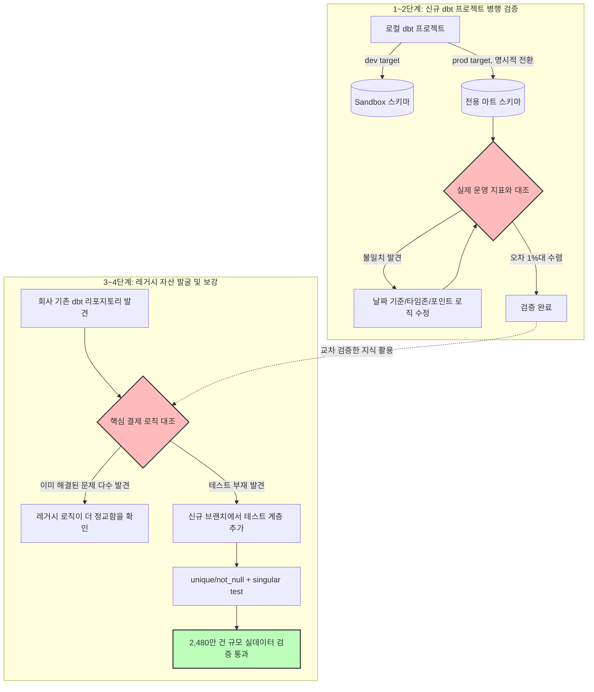

# 🔬 04. dbt 실전 적용 — 병행 검증 및 레거시 자산 되살리기

앞서 처음부터 구축한 dbt 프로젝트(03번)를 실제 운영 데이터와 병행 검증하고, 그 과정에서
회사에 이미 존재했지만 방치되어 있던 dbt 자산을 발견해 되살린 프로젝트입니다.

---

## 🤔 왜 이걸 시작했나

sandbox에서 dbt로 만든 모델들이 문법적으로는 잘 돌아갔지만, "이게 실제 운영 지표와
같은 숫자를 낼 수 있는가"는 전혀 다른 문제였습니다. dbt 실무 경험이라는 게 단순히
문법을 익히는 것을 넘어, 실제 프로덕션 데이터를 대상으로 검증하고 정확도를 맞추는
과정까지 포함해야 의미가 있다고 판단해 이 단계로 나아갔습니다.

병행 검증을 진행하던 중, 회사 소스 저장소에 이미 `data-dbt`라는 리포지토리가 존재하고,
Jenkins 기반 CI/CD와 dbt docs 웹사이트까지 갖춰진 정교한 프로젝트였다는 걸 알게
됐습니다. 다만 이 프로젝트는 한 커밋 메시지에 "데이터 정합성 확인 후, 재배포 예정"이라고
남긴 채로 그 이후 진전 없이 멈춰 있었습니다. 처음부터 새로 만드는 대신, 이미 존재하는
정교한 자산을 이해하고 되살리는 쪽이 훨씬 실무적인 가치가 있다고 판단해 방향을
전환했습니다.

---

## 💡 프로젝트 배경

### 1단계 — 안전한 실전 검증 환경 구성
운영 스키마에 바로 배포하는 대신, `dbt profiles`에 `dev`(sandbox)와 `prod`(전용 마트
스키마) 타겟을 분리하고, 기본값은 항상 안전한 `dev`를 가리키도록 설계했습니다.
`--target prod`를 명시적으로 지정할 때만 실제 마트 스키마에 반영되도록 이중 안전장치를
뒀습니다.

### 2단계 — 실제 운영 지표와의 병행 검증 (Reconciliation)
sandbox에서 만든 순 결제액 계산 모델을 실제 운영 지표(주간 정기 지표 회의에서 쓰이는
값)와 월 단위로 대조했습니다. 이 과정에서 세 가지 불일치 원인을 발견하고 수정했습니다.

| 발견한 불일치 원인 | 내용 |
|---|---|
| 날짜 기준 컬럼 | 결제 생성일이 아닌 결제 승인일 기준으로 집계해야 함 |
| 타임존 표기 혼재 | 같은 시각이 서로 다른 오프셋(+0900/+0000)으로 저장되어 월 경계에서 집계가 갈라짐 |
| 포인트 반영 여부 | 유상 포인트만이 아니라 포인트 전체(유상+무상)를 매출에 포함해야 실제 지표와 일치 |

### 3단계 — 레거시 dbt 자산 발견 및 정밀 대조
기존 `data-dbt` 리포지토리의 핵심 결제 모델을 열어보니, 저희가 sandbox에서 겪었던
문제들이 이미 훨씬 정교하게 해결되어 있었습니다.
- 취소-원결제 매칭을 `parent_payment_id` 기반 직접 조인으로 자연스럽게 처리
- 결제 타입에 따라 포인트 금액의 부호를 명시적으로 반전시키는 로직
- 요금제 시스템이 한 차례 리팩터링된 히스토리를 4가지 케이스로 분류해 반영

반면 이 레거시 프로젝트는 상세한 비즈니스 설명(description)은 갖추고 있었지만,
`unique`/`not_null`/커스텀 검증 같은 **자동 테스트가 단 하나도 걸려 있지 않았습니다.**
이는 처음 dbt를 시작하게 된 문제의식과 동일한 패턴이 회사의 기존 자산에도 그대로
재현되어 있었다는 뜻이었습니다.

### 4단계 — 레거시 자산에 자동 검증 계층 추가
기존 SQL 로직은 손대지 않고, 별도 브랜치에서 `schema.yml`에 테스트를 추가하고
비즈니스 로직 검증용 singular test를 신규 작성했습니다.

---

## 🏗️ 아키텍처



---

## 📊 성과

### 신규 프로젝트 병행 검증
| 항목 | 결과 |
|---|---|
| 완료된 달(2개월) 기준 오차 | 수정 전 3~8% → 수정 후 **1.1% 이내** |
| 발견·반영한 로직 보정 | 날짜 기준 컬럼 전환, 타임존 정규화, 포인트 포함 범위 조정 |

### 레거시 자산에 신규 테스트 계층 추가
| 대상 모델 | 데이터 규모 | 테스트 결과 |
|---|---|---|
| 핵심 결제 fact 테이블 | 약 415만 건 | `unique`, `not_null` 신규 추가 — **PASS** |
| 품목별 결제 mart 테이블 | 약 2,480만 건 | 서비스 금액 음수 여부 singular test 신규 작성 — **PASS** |

레거시 프로젝트가 멈춘 지점(정합성 미확인)에서, 실제로 검증을 수행해 **핵심 로직에
문제가 없음을 데이터로 증명**했습니다. 이는 향후 이 자산을 다시 운영에 투입할지
판단하는 근거 자료가 됩니다.

---

## 🛠️ Troubleshooting

### 1. YAML 자리표시자를 실제 값으로 착각해 인증 실패
- **문제**: `profiles.yml`의 비밀번호 필드에 예시로 쓰인 별표 문자열을 그대로 사용해 `while scanning an alias` 파싱 에러 발생
- **해결**: YAML에서 `*`가 alias 참조 문법으로 해석된다는 점을 확인, 실제 값으로 교체

### 2. dbt run과 dbt test의 순서 의존성으로 인한 혼란
- **문제**: 신규 스키마에 모델을 배포할 때 상위(upstream) 모델 없이 `test`만 실행해 "테이블 없음" 에러 발생
- **해결**: `+` 연산자로 의존성 트리 전체를 포함해 실행(`--select +모델명`)하도록 절차화, `run`(생성)과 `test`(검증)의 역할을 명확히 분리해 순서를 지킴

### 3. 시스템 컨벤션(Null 대신 0) 발견
- **문제**: 취소 건이 원 결제를 추적하는 키 값이 `NULL`이 아닌 `0`으로 저장되어, 표준적인 `COALESCE` 로직이 무력화됨
- **해결**: `NULLIF(컬럼, 0)`으로 0을 NULL 취급하도록 전처리 후 재조인. 이후 레거시 프로젝트를 검토한 결과, 이 컨벤션("0으로 입력되어 있음")이 이미 문서화되어 있었다는 것을 확인해 팀 차원의 알려진 특성임을 재확인

### 4. Seed(정적 매핑 테이블) 의존성 누락
- **문제**: 레거시 모델이 일반 소스 테이블이 아니라 CSV 기반 seed(날짜 차원, 카테고리 매핑 등)를 참조하고 있어, `dbt run`만으로는 "객체가 존재하지 않음" 에러가 반복 발생
- **해결**: `dbt seed`로 필요한 정적 테이블을 먼저 로드해야 한다는 점을 파악, 전체 seed를 한 번에 로드하는 방식으로 의존성 문제를 일괄 해결

### 5. 인증 토큰 스코프 불일치
- **문제**: 범위(scope) 지정 없이 발급한 API 토큰으로 Git 인증 시도 시 계속 실패
- **해결**: Repository 읽기/쓰기 권한을 명시적으로 포함한 스코프 지정 토큰으로 재발급하여 해결

---

## 💻 Core Code Snippet

### 1. 안전한 이중 타겟 구조 (`profiles.yml`)

sandbox와 실제 마트 스키마를 명확히 분리하고, 기본값은 항상 안전한 쪽을 향하도록
설계했습니다. `--target prod`를 명시하지 않는 한 실수로 운영 스키마에 반영될 수
없습니다.

```yaml
laundry_dw:
  outputs:
    dev:                      # 기본값 — 항상 안전한 sandbox
      schema: DBT_SANDBOX
      # ... 접속 정보
    prod:                     # 명시적으로 지정해야만 사용되는 실제 마트
      schema: ANALYTICS_MART
      # ... 접속 정보
  target: dev                 # 기본 타겟은 반드시 dev
```

### 2. 신규 작성한 비즈니스 로직 검증 (singular test)

레거시 모델의 서비스 금액 계산이 특정 조건에서 마이너스가 되지 않는지 검증하는
테스트를 신규로 작성해 2,480만 건 규모 데이터에 적용했습니다.

```sql
-- [비즈니스 룰 검증] 서비스 금액은 정상 결제 건(취소 제외)에서
-- 마이너스가 될 수 없습니다.
select
    order_id,
    user_id,
    total_price,
    service_total_price
from {{ ref('mart_item_payment') }}
where service_total_price < 0
    and subtract_type != 'NONE'
```

### 3. 발견한 레거시 로직 패턴 (마스킹)

기존 회사 dbt 프로젝트에서 발견한, 취소-원결제 매칭과 포인트 부호 처리 로직입니다.
실제 컬럼/테이블명은 보안 규정에 따라 마스킹했습니다.

```sql
-- [MASKED] 실제 컬럼/테이블명 마스킹, 로직 구조만 예시로 표현
with base as (
    select
        p.id
        , p.payment_type
        -- 결제 타입에 따라 포인트 금액의 부호를 명시적으로 반전
        -- (0: 결제 그대로, 그 외: 취소이므로 음수 처리)
        , iff(p.payment_type = 0, p.point_amount, p.point_amount * -1) as point_amount
    from {{ source('public', '[MASKED_PAYMENT_TABLE]') }} p
        -- 취소 건이 원 결제를 가리키는 키로 자기 자신을 조인
        -- (해당 키가 NULL이 아닌 0으로 저장되는 컨벤션이 있어, 자연 조인 시
        --  자동으로 미스매치 처리됨)
        left join {{ source('public', '[MASKED_PAYMENT_TABLE]') }} p2
            on p.parent_payment_id = p2.id
    where p.succeeded = 1
)
select * from base
```

---

## 🛠️ Tech Stack

`dbt-core` `dbt-snowflake` `Snowflake` `Git` `Bitbucket`
